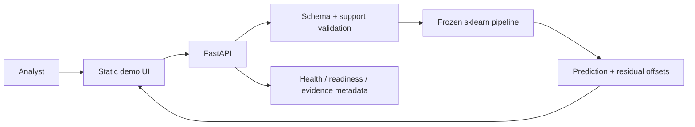
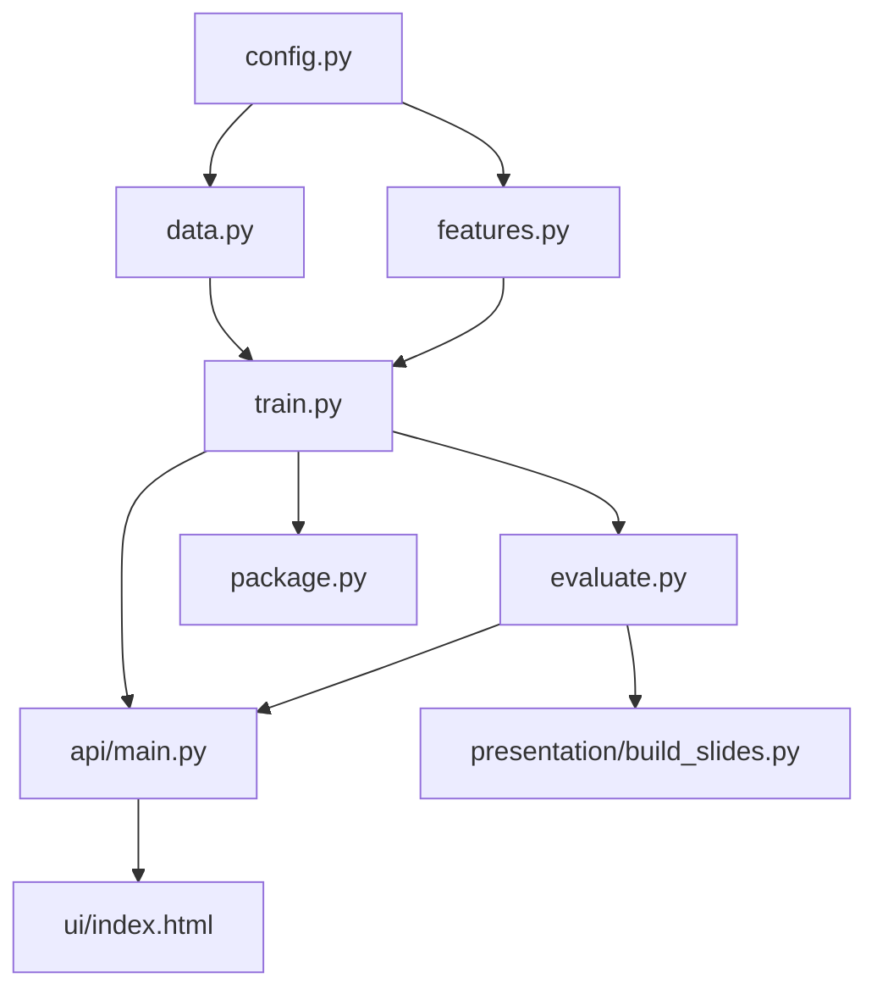
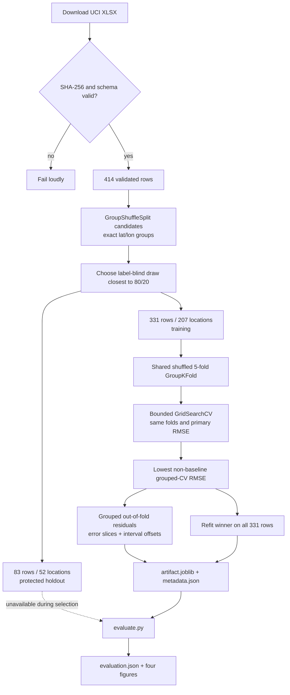
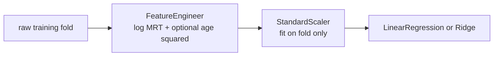
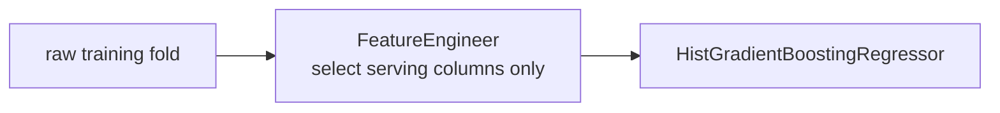
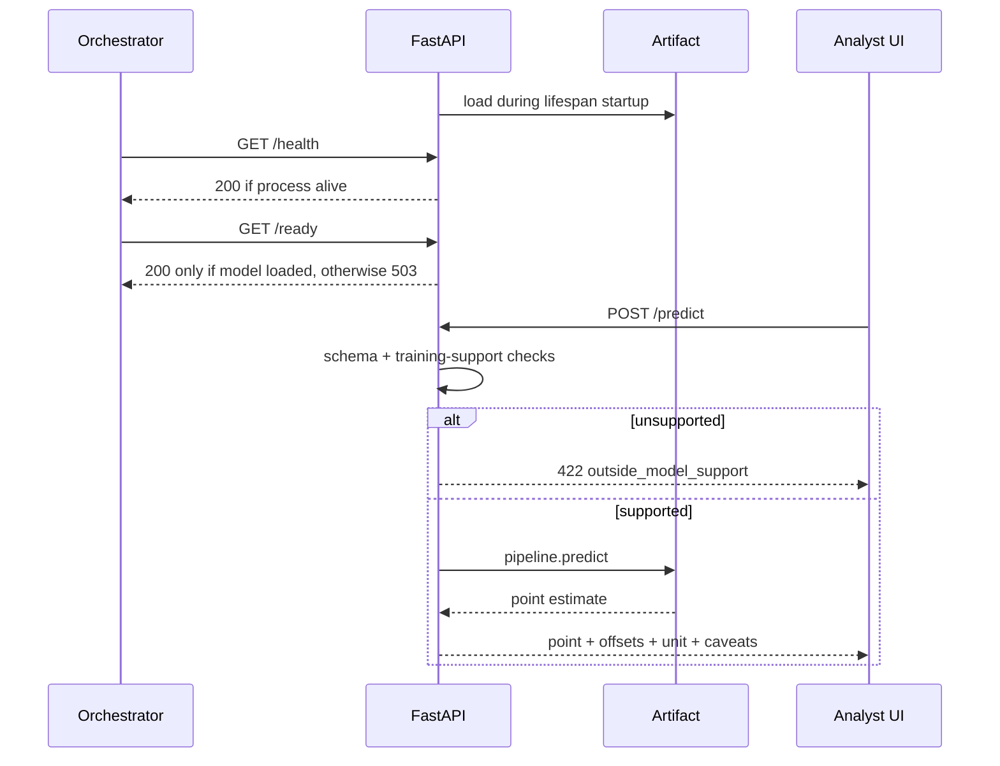

# Architecture

## System context

The solution is intentionally one deployable service. An analyst enters five
property attributes in the browser; FastAPI validates the request, loads one frozen
scikit-learn pipeline, checks empirical support and returns a price-density estimate
with an uncertainty range.

There is no database or queue because inference is stateless and the dataset/model
are build-time artifacts. That keeps the prototype easy to inspect while leaving
clear seams for a model registry or feedback store later.

## Dependency direction

| module | responsibility |
|---|---|
| `config.py` | deterministic seed, split/CV constants, paths, schema and checksum |
| `data.py` | UCI download, cache, SHA-256 and schema/content validation |
| `features.py` | fold-fitted transforms used by linear candidates |
| `train.py` | coordinate grouping, split, bounded search, selection, OOF diagnostics, persistence |
| `evaluate.py` | one protected-holdout evaluation, bootstrap uncertainty and figures |
| `api/` | artifact lifecycle, readiness, input/output contracts and inference |
| `package.py` | deterministic, clean submission archive |

Notebooks call the package rather than maintaining a second training
implementation. The deck reads persisted evidence, so numbers are regenerated from
the same run as the service.

## Evidence-producing training flow

The split search uses no target values: it only finds a reproducible group-disjoint
draw with a row count closest to 20%. All target-aware EDA and every model/parameter
decision occur after the holdout is separated.

Grouped folds protect against repeated coordinate locations crossing training and
validation. They test transfer to unseen exact locations inside the same district;
they do not establish transfer to another city or time period.

## Candidate pipelines

Linear candidates need numeric conditioning and benefit from EDA-motivated shape
changes:

The selected model uses the raw five serving inputs:

Logarithm and squaring are monotonic over the supported positive ranges, so they do
not add ordering information to tree splits. An ablation produced identical scores
for the selected histogram-boosting model. Its pipeline therefore has no redundant
transforms and no scaler.

All transforms still live inside scikit-learn `Pipeline` objects. This is important
for linear/Ridge comparisons: scaling or feature fitting before cross-validation
would leak fold-level information.

## Artifact contract

`models/house_price_model.joblib` contains:

- `point`: the exact fitted pipeline served and evaluated;
- `residual_bounds`: grouped out-of-fold 5th/95th residual quantiles;
- `metadata`: model name, best parameters, comparison table, split/fold strategies,
  row/location counts, overlap count, feature support, diagnostics, code version and
  dataset hash.

`models/metadata.json` is a human-readable copy. `docs/figures/evaluation.json`
contains final holdout metrics. The API does not calculate new evaluation evidence
at startup; it reports the evidence packaged with the image.

## Request and lifecycle flow

Separating `/health` and `/ready` prevents a live process with a missing/corrupt
artifact from receiving inference traffic.

## Container and CI

The image uses `python:3.12-slim`, a pinned `uv` binary and the locked dependency
graph. Dependencies are cached before source is copied; package source and the UI
are the only runtime inputs copied from the worktree. Data, local models, notebooks,
tests and documents are excluded by `.dockerignore`.

The container builds as UID 10001, trains and evaluates the checksum-verified data
during image construction, and then starts Uvicorn as the same non-root user. The
resulting model is therefore produced by the code and dependency lock inside that
image. Runtime does not need UCI access.

The tradeoff is explicit: an image build needs network access and training time.
For a larger system, CI would publish a separately versioned model artifact from an
approved training job and the serving image would verify its digest.

CI checks formatting/lint, performs clean training and evaluation, runs all tests,
builds the image, waits on `/ready`, makes a real prediction, verifies model metrics
are reported, and confirms an unsupported input returns 422.

## Extension seams

- Replace file-based artifact loading with an immutable model registry reference.
- Add authenticated prediction/event logging and delayed realised-price feedback.
- Run challenger models beside the champion without changing the API schema.
- Add time-aware retraining once current market data is available.
- Add geographic validation beyond exact-coordinate grouping when more districts are
  in scope.
