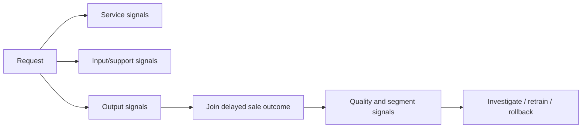

# Monitoring and operating plan

This prototype exposes the evidence needed to design monitoring, but it does not
claim to have live traffic, realised-sale labels or an alerting platform. The plan
separates what can be observed immediately from what requires delayed outcomes.

## Baseline evidence carried by the artifact

`GET /model/info` exposes the model/data identity and the training protocol:

- histogram gradient boosting and its bounded best parameters;
- dataset SHA-256 and training timestamp;
- 331 training rows / 207 training locations;
- 83 protected rows / 52 protected locations / zero overlap;
- grouped-CV train RMSE 4.36 and validation RMSE 6.94;
- protected-holdout RMSE 10.48, MAE 5.90 and R² 0.569;
- supported input ranges and observed interval coverage.

These values make a deployment identifiable. They are not all alert thresholds: the
83-row RMSE has a bootstrap 95% interval of 5.54-16.15, so treating 10.48 as a
precise service-level objective would overstate the baseline.

## Four monitoring layers

### 1. Service health

Available now:

| signal | source | response |
|---|---|---|
| process liveness | `GET /health` | restart if repeatedly unavailable |
| model readiness | `GET /ready` | remove instance from traffic on 503 |
| request count/status | access logs | investigate 5xx or sudden 422 increase |
| latency p50/p95/p99 | request middleware/platform | scale or profile regression |
| model/data version | `/model/info` | block mixed or unexpected deployment |

`/health` deliberately does not pretend that a loaded model exists. Orchestration
uses `/ready`, which returns 503 until startup has loaded and validated the artifact.

### 2. Inputs and empirical support

For each feature, aggregate rather than log raw property-level requests where
possible:

- missing/schema failure rate;
- below/inside/above training-support counts;
- median, selected quantiles and histogram buckets;
- exact-coordinate repetition and new-location rate;
- joint geographic coverage, not only independent latitude/longitude ranges.

Compare these summaries with the training distributions stored in metadata. PSI or
distribution-distance statistics can be useful triage signals, but alerts should be
calibrated on real traffic rather than assigned arbitrary universal cutoffs.

A rising `outside_model_support` rate means the service is being asked a different
question from the one it was trained to answer. Do not respond by automatically
widening limits; investigate scope and collect appropriate labels.

### 3. Predictions and uncertainty

Track:

- prediction quantiles and frequency near the learned target range;
- interval lower/upper values and fixed width;
- warning/422 frequency by field;
- analyst acceptance, override or abandonment if the UI is used operationally.

The current interval width is fixed, so width cannot detect unusual cases. That is a
known design limitation and a reason to monitor support distance separately.

### 4. Realised model quality

Predictions need a request/prediction ID, model hash and timestamp so they can be
joined later to a realised sale. Once outcomes arrive, calculate rolling metrics only
after a minimum sample count and show confidence intervals:

- RMSE, MAE and R² overall;
- median error and signed bias;
- interval coverage;
- errors by target-price band, MRT-distance band, property-age band and geography;
- worst errors reviewed for data quality, not automatically deleted.

The training-only warning to preserve is expensive-tail performance: grouped OOF
RMSE is 9.32 in the high target band versus about 5.4-5.6 elsewhere. The protected
117.5 sale produces a roughly 77.4 absolute error and contributes 65.7% of protected
total squared error. That concentration is a warning about both tail performance and
small-sample metric instability. Monitoring should therefore avoid letting a healthy
mid-market average hide systematic underprediction of expensive properties.

## Alert and response policy

Alerts should identify a decision, not merely a chart:

1. **Availability:** page on sustained readiness failure or 5xx errors; roll back the
   service/image if a new deployment caused it.
2. **Contract/support:** investigate sudden schema or out-of-support increases; do not
   retrain until the new traffic is confirmed to be in business scope.
3. **Data drift:** review data collection and market/geographic mix; acquire labels.
4. **Quality drift:** compare rolling estimates with confidence bounds, segments and
   prior versions; retrain only through the protected pipeline.
5. **Tail harm:** if expensive-band signed error is persistently negative, restrict
   usage for that segment or add a visible warning while gathering representative
   data.

## Retraining gate

A candidate retraining run must:

1. validate and version the new dataset;
2. define a new protected time/geography holdout before EDA;
3. reuse grouped or stronger geographic folds inside training;
4. run bounded/nested tuning without consulting the protected set;
5. compare champion and challenger on identical evidence and key segments;
6. publish the artifact, metadata, evaluation and data/code hashes together;
7. pass unit/integration/container tests before staged deployment.

Repeatedly scoring new experiments on the current 83 rows would convert the final
holdout into a development set. A later model needs newly protected evidence.

## Rollback and audit

The current environment-variable model path is enough to mount a different artifact,
but a production rollout also needs:

- immutable artifact/version identifiers and checksums;
- a registry mapping model to code, data and evaluation;
- two versions runnable side by side;
- a retained previous image and one-command traffic rollback;
- access-controlled prediction/feedback audit records;
- explicit retention and privacy rules for property/location data.

The immediate implementation priority would be structured request/latency metrics
and readiness alerts. The highest-value ML addition would be a delayed labelled
feedback table, because accuracy drift cannot be inferred reliably from input drift
alone.
